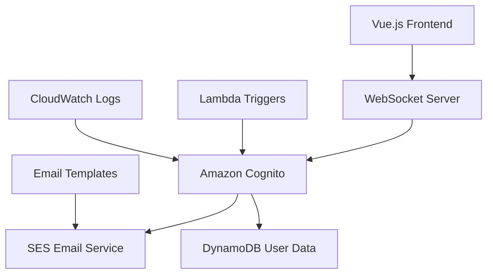

# Email Verification and Password Reset Design

## Overview

This design document outlines the implementation of email verification and
password reset functionality for Spirit of Kiro, leveraging Amazon Cognito's
built-in capabilities while providing a seamless user experience integrated with
the existing Vue.js frontend and WebSocket-based backend architecture.

## Architecture

### High-Level Architecture



### Authentication Flow Integration

The email verification and password reset will integrate with the existing
authentication system:

1. **Current Flow**: Frontend → WebSocket → Cognito
2. **Enhanced Flow**: Frontend → WebSocket → Cognito → SES → Email → User Action
   → Cognito

## Components and Interfaces

### Frontend Components (Vue.js)

#### 1. EmailVerificationPrompt.vue

```typescript
interface Props {
  email: string;
  isVisible: boolean;
}

interface Emits {
  resendVerification: () => void;
  close: () => void;
}
```

**Purpose**: Displays when user attempts to sign in with unverified email
**Features**:

- Resend verification button with rate limiting UI
- Clear instructions and email display
- Professional styling consistent with game UI

#### 2. PasswordResetRequest.vue

```typescript
interface Props {
  isVisible: boolean;
}

interface Emits {
  submitReset: (email: string) => void;
  close: () => void;
}
```

**Purpose**: Modal for requesting password reset **Features**:

- Email input with validation
- Loading states during request
- Success/error message display

#### 3. PasswordResetForm.vue

```typescript
interface Props {
  resetToken: string;
  isVisible: boolean;
}

interface Emits {
  submitNewPassword: (password: string, confirmPassword: string) => void;
  close: () => void;
}
```

**Purpose**: Secure form for setting new password **Features**:

- Password strength indicator
- Confirmation field validation
- Security guidelines display

#### 4. AuthenticationStatus.vue (Enhanced)

```typescript
interface AuthState {
  isAuthenticated: boolean;
  emailVerified: boolean;
  pendingVerification: boolean;
  user: CognitoUser | null;
}
```

**Purpose**: Enhanced to handle email verification states **Features**:

- Email verification status display
- Conditional UI based on verification state
- Integration with existing auth flow

### Backend WebSocket Handlers

#### 1. email-verification.ts

```typescript
interface VerificationRequest {
  action: "resend-verification" | "check-status";
  email?: string;
}

interface VerificationResponse {
  success: boolean;
  message: string;
  rateLimitRemaining?: number;
  nextAllowedTime?: number;
}
```

**Purpose**: Handle email verification requests **Features**:

- Rate limiting implementation
- Cognito integration for resending verification
- Status checking for verification state

#### 2. password-reset.ts

```typescript
interface PasswordResetRequest {
  action: "request-reset" | "confirm-reset";
  email?: string;
  confirmationCode?: string;
  newPassword?: string;
}

interface PasswordResetResponse {
  success: boolean;
  message: string;
  requiresConfirmation?: boolean;
}
```

**Purpose**: Handle password reset flow **Features**:

- Secure password reset initiation
- Password confirmation handling
- Session invalidation after reset

#### 3. auth-status.ts (Enhanced)

```typescript
interface AuthStatusResponse {
  isAuthenticated: boolean;
  emailVerified: boolean;
  userAttributes: {
    email: string;
    email_verified: boolean;
    sub: string;
  };
}
```

**Purpose**: Enhanced to include email verification status **Features**:

- Comprehensive auth state reporting
- Email verification status
- User attribute management

### AWS Cognito Configuration

#### User Pool Settings

```yaml
EmailConfiguration:
  EmailSendingAccount: DEVELOPER
  SourceArn: !GetAtt SESIdentity.Arn
  ReplyToEmailAddress: noreply@spiritofkiro.com

Policies:
  PasswordPolicy:
    MinimumLength: 8
    RequireUppercase: true
    RequireLowercase: true
    RequireNumbers: true
    RequireSymbols: false

AutoVerifiedAttributes:
  - email

AliasAttributes:
  - email

VerificationMessageTemplate:
  EmailSubject: "Verify your Spirit of Kiro account"
  EmailMessage: "Please click the link to verify your account: {##Verify Email##}"
  DefaultEmailOption: CONFIRM_WITH_LINK
```

#### Lambda Triggers

```typescript
// Pre-Authentication Trigger
export const preAuthentication = async (
  event: PreAuthenticationTriggerEvent,
) => {
  const { userAttributes } = event.request;

  if (userAttributes.email_verified !== "true") {
    throw new Error(
      "Email not verified. Please check your email and verify your account.",
    );
  }

  return event;
};

// Post-Confirmation Trigger
export const postConfirmation = async (event: PostConfirmationTriggerEvent) => {
  // Log successful verification
  await logSecurityEvent({
    userId: event.request.userAttributes.sub,
    event: "EMAIL_VERIFIED",
    timestamp: new Date().toISOString(),
  });

  // Send welcome email
  await sendWelcomeEmail(event.request.userAttributes.email);

  return event;
};
```

## Data Models

### User Verification State (DynamoDB)

```typescript
interface UserVerificationState {
  userId: string; // Partition Key
  email: string;
  emailVerified: boolean;
  verificationAttempts: number;
  lastVerificationSent: string; // ISO timestamp
  passwordResetAttempts: number;
  lastPasswordResetSent: string; // ISO timestamp
  securityEvents: SecurityEvent[];
  createdAt: string;
  updatedAt: string;
}

interface SecurityEvent {
  eventType:
    | "EMAIL_VERIFICATION_SENT"
    | "PASSWORD_RESET_REQUESTED"
    | "PASSWORD_RESET_COMPLETED"
    | "SUSPICIOUS_ACTIVITY";
  timestamp: string;
  ipAddress?: string;
  userAgent?: string;
  metadata?: Record<string, any>;
}
```

### Rate Limiting State (DynamoDB)

```typescript
interface RateLimitState {
  identifier: string; // email or IP address
  action: "EMAIL_VERIFICATION" | "PASSWORD_RESET";
  attempts: number;
  windowStart: string; // ISO timestamp
  blockedUntil?: string; // ISO timestamp
  ttl: number; // DynamoDB TTL
}
```

## Error Handling

### Frontend Error States

```typescript
enum AuthErrorType {
  EMAIL_NOT_VERIFIED = "EMAIL_NOT_VERIFIED",
  RATE_LIMIT_EXCEEDED = "RATE_LIMIT_EXCEEDED",
  INVALID_RESET_TOKEN = "INVALID_RESET_TOKEN",
  EXPIRED_RESET_TOKEN = "EXPIRED_RESET_TOKEN",
  WEAK_PASSWORD = "WEAK_PASSWORD",
  NETWORK_ERROR = "NETWORK_ERROR",
}

interface AuthError {
  type: AuthErrorType;
  message: string;
  retryAfter?: number;
  details?: Record<string, any>;
}
```

### Error Recovery Strategies

1. **Rate Limiting**: Display countdown timer and retry button
2. **Expired Tokens**: Automatic redirect to request new token
3. **Network Errors**: Retry mechanism with exponential backoff
4. **Validation Errors**: Real-time feedback with correction suggestions

## Testing Strategy

### Unit Tests

- **Frontend Components**: Vue Test Utils for component behavior
- **WebSocket Handlers**: Mock Cognito responses and test error scenarios
- **Lambda Functions**: Test triggers with sample Cognito events
- **Validation Logic**: Test password strength and email format validation

### Integration Tests

- **Email Flow**: End-to-end verification process testing
- **Password Reset Flow**: Complete reset process validation
- **Rate Limiting**: Test rate limit enforcement and recovery
- **Security Events**: Verify proper logging and monitoring

### End-to-End Tests

- **User Registration**: Complete signup and verification flow
- **Password Recovery**: Full password reset user journey
- **Error Scenarios**: Test expired tokens, invalid emails, etc.
- **Cross-Browser**: Ensure compatibility across different browsers

### Security Testing

- **Token Security**: Verify token unpredictability and single-use
- **Rate Limit Bypass**: Attempt to circumvent rate limiting
- **Email Enumeration**: Ensure no user enumeration through error messages
- **Session Management**: Verify proper session invalidation

## Email Templates

### Verification Email Template

```html
<!DOCTYPE html>
<html>
  <head>
    <meta charset="utf-8">
    <title>Verify Your Spirit of Kiro Account</title>
  </head>
  <body
    style="font-family: Arial, sans-serif; max-width: 600px; margin: 0 auto"
  >
    <div
      style="background: linear-gradient(135deg, #667eea 0%, #764ba2 100%); padding: 20px; text-align: center"
    >
      <h1 style="color: white; margin: 0">Spirit of Kiro</h1>
    </div>

    <div style="padding: 30px; background: #f9f9f9">
      <h2>Welcome to Spirit of Kiro!</h2>
      <p>
        Thank you for creating your account. To complete your registration and
        start your crafting journey, please verify your email address.
      </p>

      <div style="text-align: center; margin: 30px 0">
        <a
          href="{##Verify Email##}"
          style="background: #667eea; color: white; padding: 15px 30px; text-decoration: none; border-radius: 5px; display: inline-block"
        >
          Verify Email Address
        </a>
      </div>

      <p><strong>This link will expire in 24 hours.</strong></p>

      <p>
        If you didn't create this account, you can safely ignore this email.
      </p>

      <hr style="margin: 30px 0; border: none; border-top: 1px solid #ddd">
      <p style="font-size: 12px; color: #666">
        This email was sent to {email}. If you have questions, contact us at
        support@spiritofkiro.com
      </p>
    </div>
  </body>
</html>
```

### Password Reset Email Template

```html
<!DOCTYPE html>
<html>
  <head>
    <meta charset="utf-8">
    <title>Reset Your Spirit of Kiro Password</title>
  </head>
  <body
    style="font-family: Arial, sans-serif; max-width: 600px; margin: 0 auto"
  >
    <div
      style="background: linear-gradient(135deg, #667eea 0%, #764ba2 100%); padding: 20px; text-align: center"
    >
      <h1 style="color: white; margin: 0">Spirit of Kiro</h1>
    </div>

    <div style="padding: 30px; background: #f9f9f9">
      <h2>Password Reset Request</h2>
      <p>
        We received a request to reset your password. If you made this request,
        click the button below to set a new password.
      </p>

      <div style="text-align: center; margin: 30px 0">
        <a
          href="{##Reset Password##}"
          style="background: #e74c3c; color: white; padding: 15px 30px; text-decoration: none; border-radius: 5px; display: inline-block"
        >
          Reset Password
        </a>
      </div>

      <p><strong>This link will expire in 1 hour.</strong></p>

      <div
        style="background: #fff3cd; border: 1px solid #ffeaa7; padding: 15px; border-radius: 5px; margin: 20px 0"
      >
        <p style="margin: 0; color: #856404">
          <strong>Security Notice:</strong> If you didn't request this password
          reset, please ignore this email. Your account remains secure.
        </p>
      </div>

      <hr style="margin: 30px 0; border: none; border-top: 1px solid #ddd">
      <p style="font-size: 12px; color: #666">
        This email was sent to {email}. If you have questions, contact us at
        support@spiritofkiro.com
      </p>
    </div>
  </body>
</html>
```

## Security Considerations

### Token Security

- **Cryptographic Randomness**: Use AWS Cognito's built-in secure token
  generation
- **Single Use**: Tokens are invalidated immediately after use
- **Time-Limited**: Verification tokens expire in 24 hours, reset tokens in 1
  hour
- **Unpredictable**: Tokens cannot be guessed or enumerated

### Rate Limiting Strategy

- **Email Verification**: Maximum 3 requests per hour per email address
- **Password Reset**: Maximum 5 requests per hour per email address
- **IP-Based Limiting**: Additional protection against distributed attacks
- **Exponential Backoff**: Increasing delays for repeated violations

### Privacy Protection

- **No User Enumeration**: Same response for valid and invalid email addresses
- **Secure Logging**: Personal information excluded from logs
- **Data Minimization**: Only necessary data stored and transmitted
- **GDPR Compliance**: User data handling follows privacy regulations

### Monitoring and Alerting

- **Failed Attempts**: Track and alert on suspicious patterns
- **Rate Limit Violations**: Monitor for potential attacks
- **Token Usage**: Log token generation and consumption
- **Email Delivery**: Monitor bounce rates and delivery failures

## Performance Considerations

### Caching Strategy

- **User Verification State**: Cache in Redis for fast lookups
- **Rate Limit Counters**: Use Redis with TTL for efficient rate limiting
- **Email Templates**: Cache compiled templates in memory
- **Cognito Responses**: Cache user attributes for short periods

### Scalability

- **Asynchronous Processing**: Email sending handled asynchronously
- **Database Optimization**: Proper indexing for verification state queries
- **CDN Integration**: Static assets served through CloudFront
- **Auto-Scaling**: Lambda functions scale automatically with demand

### Monitoring Metrics

- **Email Delivery Rate**: Track successful email deliveries
- **Verification Completion Rate**: Monitor user verification success
- **Password Reset Success Rate**: Track successful password resets
- **Response Times**: Monitor API response times for auth operations
